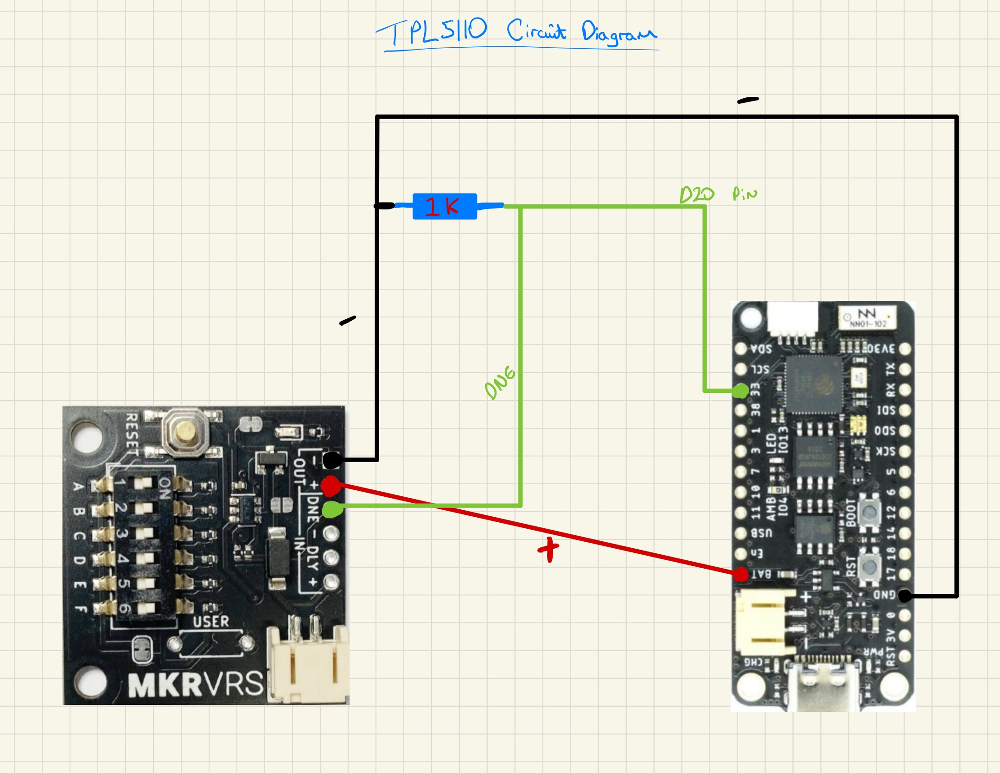

# Greenhouse-Monitor
 Built a mini greenhouse and I want a system to monitor the temperature, humidity, and soil moisture levels. This is very much still a work in progress and this will be updated as I go along. 
 
 Last update: (04-07-22)


## Parts used so far

- FeatherS2 using CircuitPython (brand: unexpected maker) - [Link](https://feathers2.io)
- BME280 - [Link](https://core-electronics.com.au/piicodev-atmospheric-sensor-bme280.html)
- TPL5110 - - FeatherS2 (brand: unexpected maker) - [Link](https://core-electronics.com.au/makerverse-nano-power-timer.html)
- 1K resistor for the TPL5110
- 18650 battery
- Battery connector
- Stemma QT cables (QWIIC/PiicoDEV) - [Link](https://core-electronics.com.au/piicodev-cable-200mm.html)
- Wire

## Temperature/Humidity/Pressure

I'm using a BME280 to measure the temperature and humidity, it's my go to sensor for this sort of stuff. The specific one I'm using here has a Stemma QT connection so I don't need to solder it, which is nice. 

### Steps:

This part is pretty straight forward really:
- Just connect the sensor to the Feather S2 using the Stemma QT port.
- I'm using the 'adafruit_bme280' library and to take readings in CircuitPython:

```python
# Import library:
from adafruit_bme280 import basic as adafruit_bme280
# Initialise i2c and setup sensor:
i2c = board.I2C()  # uses board.SCL and board.SDA
bme280 = adafruit_bme280.Adafruit_BME280_I2C(i2c)
# Print out the readings:
print("\nTemperature: %0.1f C" % bme280.temperature)
print("Humidity: %0.1f %%" % bme280.humidity)
print("Pressure: %0.1f hPa" % bme280.pressure)
```

- Print a case to keep the sensor protected. STL files [Here](https://feathers2.io)


## TPL5110 power timer

I've used this little board to help reduce the daily power needed to run my sensors. Works like a charm so far. Great guide [Here](https://core-electronics.com.au/guides/raspberry-pi-pico/makerverse-nano-power-timer/).

Code for CircuitPython:
```python
import digitalio

# Set-up pin to LOW, ready to send TPL5110 a signal.
pin = digitalio.DigitalInOut(board.D20)
pin.direction = digitalio.Direction.OUTPUT
pin.value = False

# Send TPL5110 a signal:
    pin.value = True
```

NOTE: For ESP32's (including this ESP32-S2), PINs are put HIGH for a short period of time at start up. I've needed to add a 1K resistor between the DONE and IN (gnd) to pull down the PIN enough to stop the TPL5110 cutting power every Feather boot-up.

### Circuit diagram



##  Moisture Sensor

Working on this next.


## Solar powered

Waiting for a sunny period to test this.